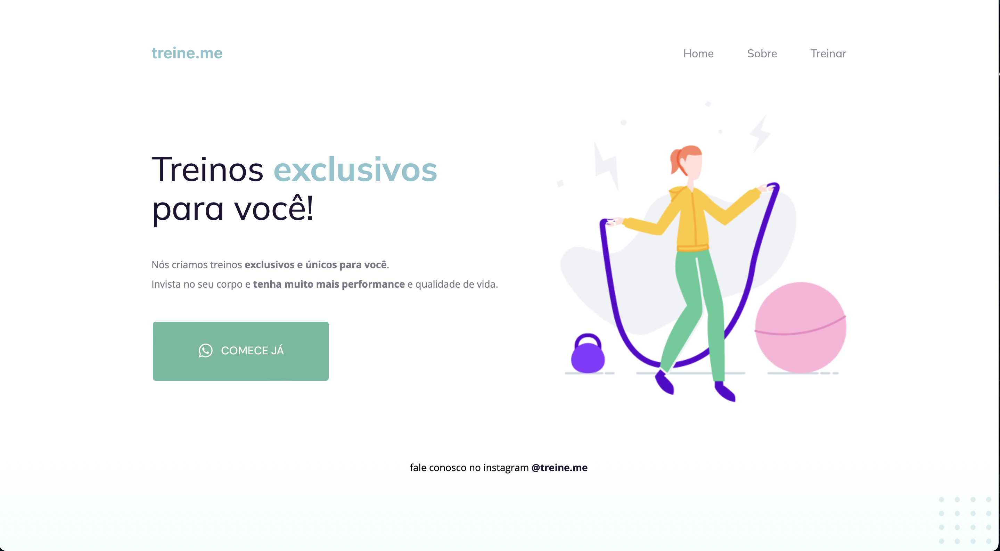
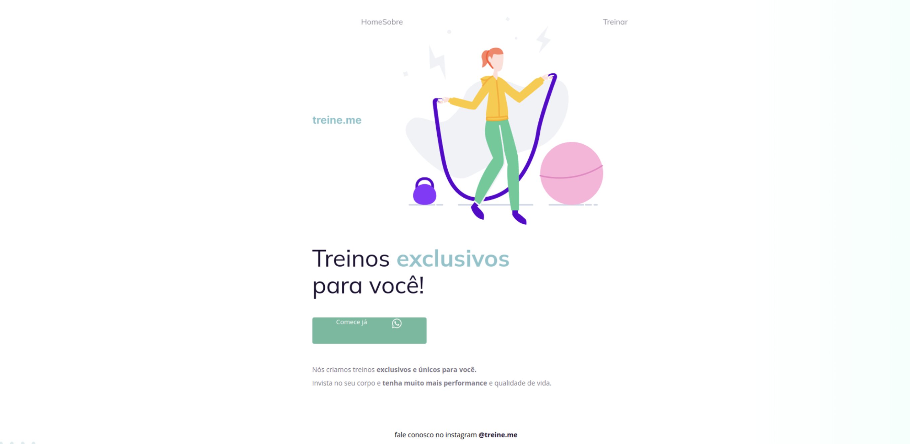

# 📌 **Arrumando código quebrado e deixando a página semântica e acessível para os leitores de tela e motores de busca, como o Google.** 

## 🫴🏼 _Fixing broken code and making the page semantic and accessible to screen readers and search engines, like Google._ 

 
  

📸 _Screenshot_
 _Remanufactured code_

# 🛰 _Tecnologies_
- **[HTML](../index.html)**
- [CSS](../css.html)
- **[JavaScript](../js.html)**
- [Github](https://github.com/)
- **[Figma](https://www.figma.com/file/9K6bNIKzUs7fnl80o7Ssuq/Explorer---Projeto-02-(Copy)?node-id=1%3A5&t=NflPudBizJKxWWkS-0)**
- [VScode](##VScode)

# 👩🏻‍💻 _Project_ 

🇧🇷 **O objetivo inicial era de corrigir o código HTML, que não estava semântico e tinha problemas de acessibilidade.  
Impactando negativamente nos leitores de tela e com performance ruim em motores de busca, como o Google.**

 

🇺🇸 _The initial objective was to correct the HTML, code that was not semantic and had accessibility problems.  
Negatively impacting screen readers and performing poorly on search engines like Google._ 

 

📸 **Captura de tela antes de remanufaturar o código:**
 
🇺🇸 _Screenshot before remanufacturing the code:_ 

#

 Feito com ♥︎ by BM 
  

#

- **[Projeto on-line aqui]('file:///Users/biancamos/Desktop/teinos_exclusivos/index.html#)**
- _[On-line project here]('f'ile:///Users/biancamos/Desktop/teinos_exclusivos/index.html#)_

#

                          🗓 Desenvolvido em:
                🇧🇷 Fevereiro de 2023 - Rocketseat (Explorer)

                          🗓 Developed in:
                 🇺🇸 February 2023 - Rocketseat (Explorer)

